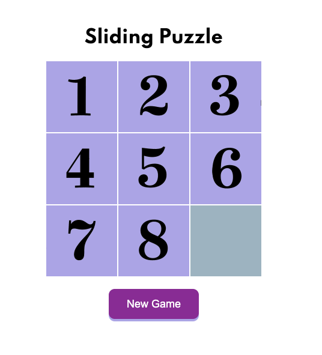

    

<h1 id="puzzle">🧩 Sliding Puzzle </h1>

This is teh traditional Sliding puzzle, try it and let me know what do you think about it.
You can see it here → [Sliding Puzzle](http://puzzle.alexcamachogz.com/).

## Table of contents

- [Sliding Puzzle](#puzzle)
- [Available Scripts](#scripts)
- [Preview](#preview)
- [Technologies](#technologies)
- [Author](#author)

<h2 id="scripts">🔥 Available Scripts</h2>
Not dependencies are required for this project.

<h2 id="preview">🔍 Preview</h2>

<h2 id="technologies">📌 Technologies</h2>

1. Semantic HTML
2. Vanilla CSS
3. Vanilla JS

<h2 id="author">🌟 Author</h2>

**Alejandra Camacho** - [@alexcamachogz](https://github.com/alexcamachogz)

